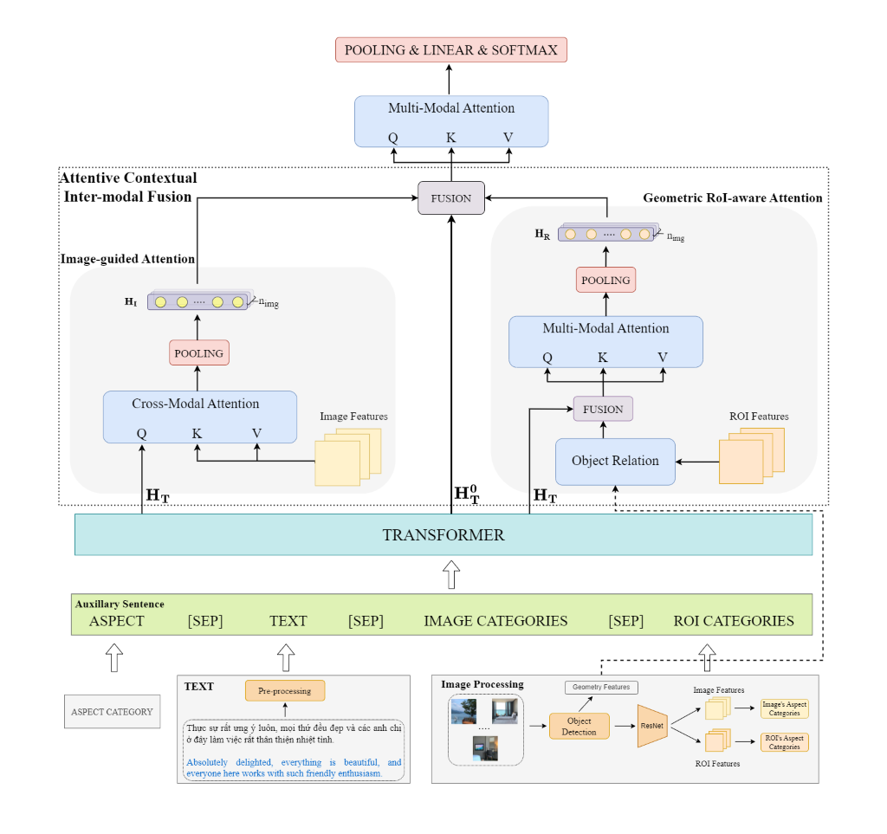
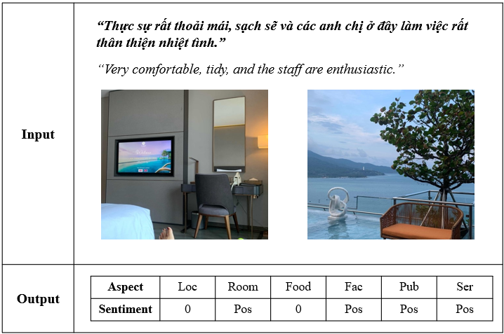
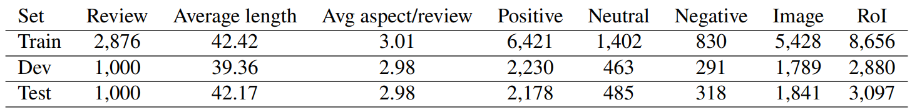
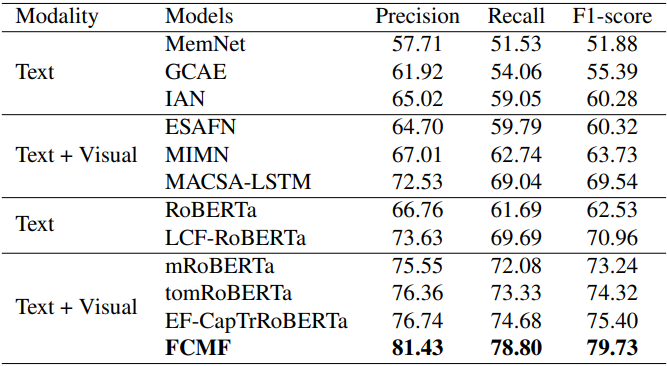

# ViMACSA: Vietnamese Multimodal Aspect-Category Sentiment Analysis
# Overview
*  Introduce a new Vietnamese multimodal dataset, named ViMACSA, which consists of 4,876 text-image pairs with 14,618 fine-grained annotations for both text and image in the hotel domain.
*  Propose a Fine-Grained Cross-Modal Fusion Framework (FCMF) that effectively learns both intra- and inter-modality interactions.
  


## Table of Contents

- [Dataset](#dataset)
- [Running The Code](#running-the-code)
- [Compare with different baseline models](#compare-with-different-baseline-models)
- [Citation](#citation)
- [To Do](#todo)

# Dataset
Our ViMACSA dataset comprises 4,876 documents and 14,000 images. Each document is accompanied by up to 7 images. This dataset is constructed with the goal of recognizing both explicit aspects and implicit aspects in the document.

<p align="left">
  
</p>


To understand more about the dataset, please read this paper: [New Benchmark Dataset and Fine-Grained Cross-Modal Fusion Framework for Vietnamese Multimodal Aspect-Category Sentiment Analysis
](https://arxiv.org/abs/2405.00543) 

Our dataset is used only for research purposes. Download our ViMACSA dataset on reasonable request: https://drive.google.com/file/d/1OjWwzdbhvhYc864Tpt6Xw9anBLfgNwmt/view?usp=sharing

## Dataset statistics

*Table 1. The overview statistics of ViMACSA dataset.*

# Running The Code
## Install Requirements
```
pip install -r requirements.txt
```
## Get Image/RoI Aspect Category
### Image
```
python image_processing/run_image_categories.py 
      --image_dir path_to_image_folder
      --image_label_path path_to_image_label #all_image_label.xlsx 
      --output_dir test_image 
      --do_train 
      --get_cate #whether to get image category
```
### RoI
```
python image_processing/run_roi_categories.py 
      --image_dir path_to_image_folder 
      --roi_label_path path_to_roi_label #test_roi_data.csv 
      --output_dir test_image 
      --do_train 
      --get_cate #whether to get RoI category
```

## Training FCMF Framework
```
!torchrun --standalone --nproc_per_node=n_gpu run_multimodal_fcmf.py
        --data_dir data_folder_dir
        --list_aspect Location Food Room Facilities Service Public_area 
        --num_polarity 4 --num_imgs 7 --num_rois 4
        --image_dir path_to_image_folder
        --pretrained_model vinai/phobert-base 
        --output_dir model_output 
        --train_batch_size 8  --eval_batch_size 8 
        --num_train_epochs 8
        --learning_rate 3e-5 
        --warmup_proportion 0.1 --gradient_accumulation_steps 2 
        --do_train
        --fp16 
        --ddp 
```
## Inference
Download our weights and place them in the same folder: https://drive.google.com/file/d/1NHI24JxyjXfi1lU7nF99-TV7vBL-StZm/view?usp=sharing
```
python inference.py --text "Khách sạn này rất đẹp, nhân viên nhiệt tình"
                    --image_list image_0.png image_1.png image_2.png
                    --num_rois 4
```

# Compare with different baseline models.
                   
*Table 2. Experiment results on the ViMACSA dataset.*

# Citation
Please cite the following paper if you use this dataset:
```bibtex
@article{nguyen2025new,
  title={New benchmark dataset and fine-grained cross-modal fusion framework for Vietnamese multimodal aspect-category sentiment analysis},
  author={Nguyen, Quy Hoang and Nguyen, Minh-Van Truong and Van Nguyen, Kiet},
  journal={Multimedia Systems},
  volume={31},
  number={1},
  pages={1--28},
  year={2025},
  publisher={Springer}
}
```

# Contact
If you have any questions, please feel free to contact nhq188@gmail.com.

# Todo
- [x] Multi GPU training with DDP.
- [x] Custom classification class.
- [x] Flexible Framework Architecture.
- [x] Add Inference.
- [ ] Intergate with Spark.
